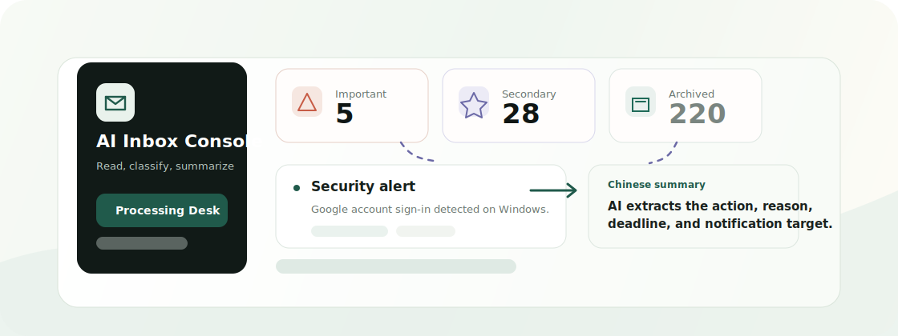
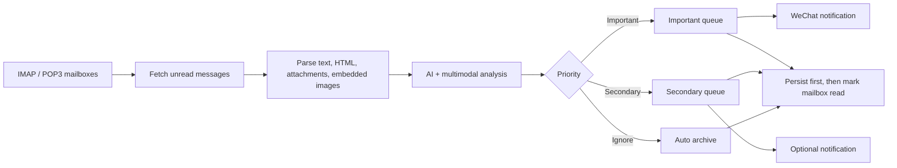

<p align="center">
  
</p>

<h1 align="center">Auto Email System</h1>

<p align="center">
  An AI inbox console that reads unread mail, triages what matters, writes Chinese summaries, and can notify you through WeChat.
</p>

<p align="center">
  <a href="README.zh-CN.md">中文版本</a>
</p>

<p align="center">
  <a href="https://github.com/Ha22yX/auto-email-system"></a>
  
  
  
</p>

<p align="center">
  
</p>

## What It Is

Auto Email System is not another inbox client. It is a result-oriented email control center: it scans unread messages from one or more mailboxes, asks AI to decide whether each message is worth your attention, and turns the chaos into three clean queues.

| Queue | What belongs here | Default behavior |
| --- | --- | --- |
| Important | Teachers, school staff, security alerts, payment problems, contracts, deadlines, replies required | Kept unread inside the console, can trigger WeChat notifications |
| Secondary | Payment receipts, order confirmations, billing records, general notices, useful-but-not-urgent information | Marked read when opened, optional notifications |
| Ignore | Promotions, admissions marketing, newsletters, subscriptions, social reminders, low-value notices | Archived as system-read |

Every processed email gets a Chinese summary, classification reason, suggested actions, and a safe original-email preview. The goal is simple: stop reading everything, and start seeing only what matters.

## Why It Feels Different

| Capability | Why it matters |
| --- | --- |
| Multi-mailbox processing | Add IMAP and POP3 accounts, then view each mailbox separately or all mail together. |
| AI triage and summaries | Configure provider name, Base URL, model, API key, and temperature from the admin panel. |
| Multimodal understanding | Built-in support for GLM-5V-Turbo to inspect embedded images, image attachments, and PDFs so important content does not hide inside files. |
| Real-time persistence | Each email is saved as soon as it is processed. The original mailbox is marked read only after the record is safely stored. |
| Safe original preview | Email HTML is rendered in a sandboxed iframe. Scripts, forms, plugins, unsafe links, and unsafe image loads are blocked. |
| Internal read state | Important mail stays system-unread until you spend time in the detail view. Secondary mail becomes read on click. Right-click toggles are supported. |
| WeChat notifications | Integrated WeClaw / ClawBot bridge can push important email summaries to a bound WeChat account. |
| Self-hosted control | Runs as a single Node app with local JSON storage. Works locally, on a VPS, or as a Baota / BT Panel Node project. |

## Workflow



## Product Shape

```text
Auto Email System
├─ Processing Desk
│  ├─ All mailboxes
│  ├─ Per-mailbox views
│  ├─ Important / Secondary / Ignore queues
│  ├─ Chinese summary list
│  └─ Email detail: summary, reason, actions, original render
└─ Admin Settings
   ├─ AI API and multimodal model
   ├─ Polling strategy
   ├─ Multi-mailbox setup
   ├─ WeChat ClawBot notifications
   └─ Login password
```

## Tech Stack

| Layer | Stack |
| --- | --- |
| Frontend | React 19, Vite, TypeScript, Phosphor Icons |
| Backend | Express 5, TypeScript, tsx |
| Email | imapflow, mailparser, custom POP3 reader |
| AI | Zhipu GLM Coding Plan / Anthropic-compatible API, GLM-5V-Turbo multimodal |
| Storage | Local JSON database: `data/app.db.json` |
| Notifications | In-project WeClaw / ClawBot bridge |

## Quick Start

```bash
npm install
npm run build
npm run start
```

Open:

```text
http://127.0.0.1:8787
```

Development mode:

```bash
npm run dev
```

The web app defaults to `http://127.0.0.1:5173`; the API defaults to `http://127.0.0.1:8787`.

## First-Time Setup

1. Log in to the admin panel.
2. Change the default password. The initial password is `Admin12345`; change it before exposing the service.
3. Fill in your AI API settings.
4. Add one or more IMAP / POP3 mailboxes.
5. Test each mailbox connection.
6. Go back to the Processing Desk and click "Process now", or enable automatic polling.

Common email ports:

| Protocol | SSL/TLS | Plain |
| --- | ---: | ---: |
| IMAP | `993` | `143` |
| POP3 | `995` | `110` |

Most providers require enabling IMAP/POP3 in mailbox settings and using an app password or authorization code instead of your normal web-login password.

## AI Configuration

The default setup targets Zhipu GLM Coding Plan:

| Field | Default |
| --- | --- |
| Anthropic-compatible Base URL | `https://open.bigmodel.cn/api/anthropic` |
| Chat Completions Base URL | `https://open.bigmodel.cn/api/coding/paas/v4` |
| Text model | `glm-5.2` |
| Multimodal model | `glm-5v-turbo` |

The classification prompt is intentionally strict:

- Anything you must read, confirm, reply to, save, or act on should become Important or Secondary.
- Promotions, admissions marketing, newsletters, and subscription marketing should become Ignore.
- Payment receipts, charge confirmations, order confirmations, and billing records should become Secondary, not Ignore.
- Teachers, school staff, courses, assignments, deadlines, and account security should become Important.

## WeChat Notifications

The admin panel includes ClawBot notification settings. When enabled, the system can push processed important-mail summaries to WeChat.

Highlights:

- The notification bridge can start with the app.
- QR-code binding stores session state and survives restarts.
- Notification categories are configurable: Important, Secondary, Ignore.
- The bridge sends only the email summary produced by this system. It does not forward your WeChat chats to AI.

WeClaw source: <https://github.com/fastclaw-ai/weclaw>  
Related license file: `tools/weclaw/LICENSE`.

## Security Model

This project handles mailbox authorization codes, AI keys, and raw email content, so security is part of the core design.

| Protection | Details |
| --- | --- |
| Password login | The admin panel is password protected. Sessions last 7 days by default. |
| Password hashing | Admin password is stored with PBKDF2 + salt. |
| Brute-force protection | Too many failed login attempts temporarily block the source IP. |
| CSRF defense | Mutating requests from untrusted origins are rejected. |
| Security headers | CSP, X-Frame-Options, nosniff, Referrer-Policy, and related headers are enabled. |
| Sandboxed original email | Original HTML is rendered in a sandboxed iframe with scripts, forms, and plugins disabled. |
| Image proxy | Remote images are fetched through a backend proxy that blocks private IPs, credential URLs, unsafe ports, and oversized files. |
| No indexing | `robots.txt` and `X-Robots-Tag` are included to discourage search engine indexing. |

Important: `data/` stores mailbox authorization codes, AI keys, processed email records, and runtime state. It is excluded by `.gitignore`. Do not commit `data/`, `.env`, server passwords, or BT/Baota API keys.

## Deployment Notes

Recommended deployment targets:

- Local long-running process
- VPS + Node.js
- Baota / BT Panel Node project
- systemd, PM2, or your own Docker packaging

Production suggestions:

- Use HTTPS.
- Change the default login password.
- Harden SSH access on the server.
- Back up `data/app.db.json` regularly.
- Do not expose the app to untrusted shared users.

## Repository Layout

```text
data/app.db.json      Local database for settings, mailboxes, emails, and run history
public/robots.txt     Search engine blocking rule
server/src/           Express API, email processing, AI, notifications, security
src/                  React admin console
tools/weclaw/         WeClaw / ClawBot runtime files
```

## Who This Is For

- You receive too many emails, but only a few actually matter.
- School, teacher, billing, security, order, and receipt emails are mixed with noise.
- You want AI to read first and surface the real work.
- You prefer a self-hosted system instead of giving a third-party client long-term mailbox access.

## License

This repository currently does not declare a project-wide open-source license. If you plan to redistribute it publicly, add a project license first and follow the license requirements in `tools/weclaw/LICENSE`.
