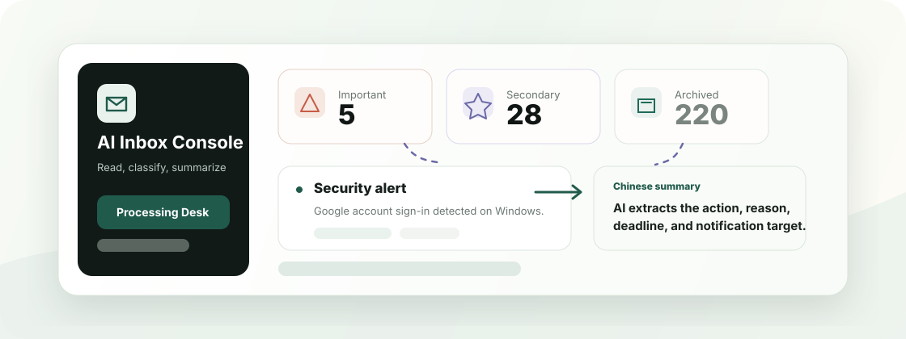
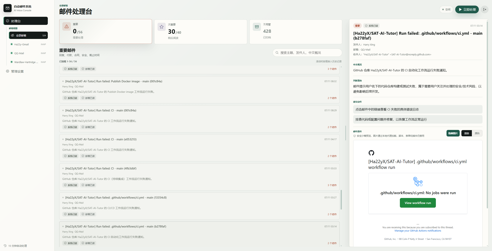
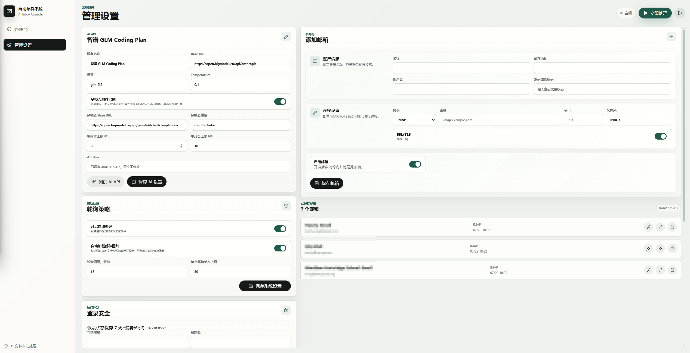
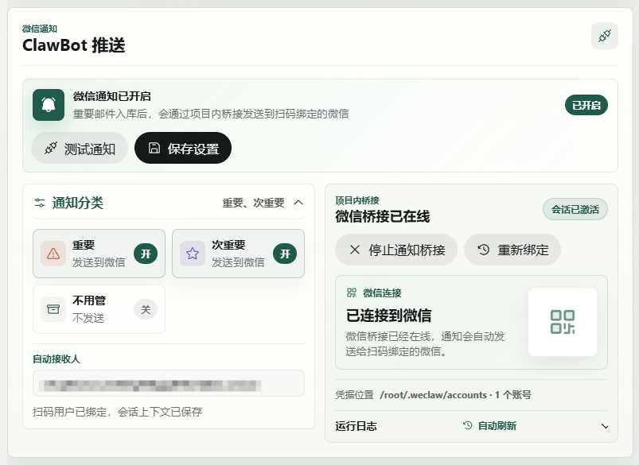
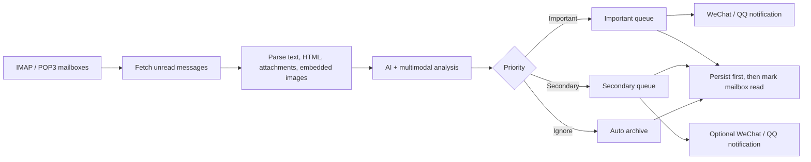

<p align="center">
  
</p>

<h1 align="center">Auto Email System</h1>

<p align="center">
  Stop letting junk mail decide how you spend your attention. Auto Email System reads your inbox first, filters out the noise, summarizes the email worth seeing into Chinese key points, and can notify you on WeChat.
</p>

<p align="center">
  <a href="README.zh-CN.md">中文版本</a>
</p>

<p align="center">
  <a href="https://github.com/Ha22yX/auto-email-system"></a>
  <a href="https://github.com/Ha22yX/auto-email-system/pkgs/container/auto-email-system"></a>
  
  
  
</p>

<p align="center">
  
</p>

## Demo Screenshots

<table>
  <tr>
    <td colspan="2" align="center">
      
      <br />
      <strong>Processing desk.</strong> Important mail is separated from inbox noise, summarized in Chinese, and prepared for action or WeChat notification.
    </td>
  </tr>
  <tr>
    <td width="50%">
      
    </td>
    <td width="50%">
      
    </td>
  </tr>
  <tr>
    <td><strong>Management settings.</strong> Configure AI models, IMAP/POP3 mailboxes, polling rules, attachment handling, and access security from one panel.</td>
    <td><strong>WeChat alerts.</strong> Choose which queues trigger notifications and keep the ClawBot bridge connected for important-mail summaries.</td>
  </tr>
</table>

## Why This Exists

Most inboxes are not hard because of email volume alone. They are hard because school notices, security warnings, bills, receipts, deadlines, and marketing blasts all arrive in the same stream and demand the same attention.

Auto Email System is built to give that attention back to you. It checks unread IMAP/POP3 mail, ignores low-value noise, keeps useful records in a secondary queue, lifts real action items into an important queue, summarizes them in Chinese, and can send the key points to WeChat so you only open the inbox when something is actually worth reading.

The result is a cleaner day: fewer random inbox checks, less time wasted on spam, and a short list of emails that actually need your eyes.

| Inbox pain | What the system does |
| --- | --- |
| Junk and marketing mail steal your time | Classifies low-value mail as Ignore so it no longer drives your attention |
| Useful records are mixed with urgent work | Separates Important, Secondary, and Ignore queues |
| Long or foreign-language emails slow you down | Generates concise Chinese summaries, reasons, and suggested actions |
| Important details are hidden in files | Uses multimodal analysis for embedded images, image attachments, and PDFs |
| You do not want to keep checking the inbox | Sends selected email summaries to WeChat when they are worth seeing |

## Quick Start

Prerequisites:

- Node.js 24.x
- npm
- An IMAP or POP3 mailbox account
- An AI API key compatible with the configured model provider

Run locally:

```bash
npm install
npm run build
npm run start
```

Open:

```text
http://127.0.0.1:8787
```

Development mode:

```bash
npm run dev
```

The web app defaults to `http://127.0.0.1:5173`; the API defaults to `http://127.0.0.1:8787`.

## Docker / GHCR

The repository publishes a Docker image to GitHub Container Registry:

```bash
docker pull ghcr.io/ha22yx/auto-email-system:latest
docker run -d \
  --name auto-email-system \
  -p 8787:8787 \
  -v auto-email-data:/data \
  -e DATA_DIR=/data \
  ghcr.io/ha22yx/auto-email-system:latest
```

The image is built by `.github/workflows/docker-publish.yml` on pushes to `main`. Do not bake mailbox passwords, AI API keys, WeChat/ClawBot sessions, `.env`, or `data/` into the image. Configure secrets at runtime through the app UI, environment variables, or a mounted `/data` volume.

## First-Time Setup

1. Log in to the admin panel.
2. Change the default password. The initial password is `Admin12345`; change it before exposing the service.
3. Fill in your AI API settings.
4. Add one or more IMAP / POP3 mailboxes.
5. Test each mailbox connection.
6. Click "Process now" in the Processing Desk, or enable automatic polling.

Common email ports:

| Protocol | SSL/TLS | Plain |
| --- | ---: | ---: |
| IMAP | `993` | `143` |
| POP3 | `995` | `110` |

Most providers require enabling IMAP/POP3 in mailbox settings and using an app password or authorization code instead of your normal web-login password.

## Core Features

| Feature | Why it matters |
| --- | --- |
| Multi-mailbox console | Add IMAP and POP3 accounts, then view each mailbox separately or all mail together. |
| AI triage | Classifies unread mail into Important, Secondary, or Ignore. |
| Chinese summaries | Produces concise Chinese summaries, classification reasons, and suggested actions. |
| Multimodal attachment analysis | GLM-5V-Turbo can inspect embedded images, image attachments, and PDFs. |
| Safe original preview | Email HTML is rendered in a sandboxed iframe with dangerous behavior blocked. |
| Internal read state | Important mail can stay system-unread until you spend time in the detail view. |
| WeChat alerts | Integrated WeClaw / ClawBot bridge can push selected email summaries to WeChat. |
| QQ Bot alerts | Official QQ Bot WebSocket Gateway + REST delivery with private-chat binding. |
| QQ mail agent | Multi-step tools for full-text search, attachment inspection/sending, confirmed writes, and auditable runs. |
| Agent isolation | Mail and attachment content is untrusted data; writes and media exports require explicit intent in the current user message. |
| FTS5 search | Trigram indexing covers subjects, senders, summaries, bodies, and attachment names with automatic backfill. |
| Self-hosted storage | Indexed, transactional SQLite storage in `data/app.sqlite`. |

## Priority Queues

| Queue | What belongs here | Default behavior |
| --- | --- | --- |
| Important | Teachers, school staff, security alerts, payment problems, contracts, deadlines, replies required | Kept unread inside the console, can trigger WeChat notifications |
| Secondary | Payment receipts, order confirmations, billing records, general notices, useful-but-not-urgent information | Marked read when opened, optional notifications |
| Ignore | Promotions, admissions marketing, newsletters, subscriptions, social reminders, low-value notices | Archived as system-read |

## Workflow


```mermaid
flowchart LR
  A["IMAP / POP3 mailboxes"] --> B["Fetch unread messages"]
  B --> C["Parse text, HTML, attachments, embedded images"]
  C --> D["AI + multimodal analysis"]
  D --> E{"Priority"}
  E -->|Important| F["Important queue"]
  E -->|Secondary| G["Secondary queue"]
  E -->|Ignore| H["Auto archive"]
  F --> I["WeChat / QQ notification"]
  G --> J["Optional WeChat / QQ notification"]
  F --> K["Persist first, then mark mailbox read"]
  G --> K
  H --> K
```

## Tech Stack

| Layer | Stack |
| --- | --- |
| Frontend | React 19, Vite, TypeScript, Phosphor Icons |
| Backend | Express 5, TypeScript, tsx |
| Email | imapflow, mailparser, custom POP3 reader |
| AI | Zhipu GLM Coding Plan / Anthropic-compatible API, GLM-5V-Turbo multimodal |
| Storage | SQLite: `data/app.sqlite`, with one-time migration from legacy JSON data |
| Notifications | Sharp-rendered mail cards, in-project WeClaw / ClawBot bridge, official QQ Bot Gateway + REST API |

## AI Configuration

The default setup targets Zhipu GLM Coding Plan:

| Field | Default |
| --- | --- |
| Anthropic-compatible Base URL | `https://open.bigmodel.cn/api/anthropic` |
| Chat Completions Base URL | `https://open.bigmodel.cn/api/coding/paas/v4` |
| Text model | `glm-5.2` |
| Multimodal model | `glm-5v-turbo` |

The classification prompt is intentionally strict:

- Anything you must read, confirm, reply to, save, or act on should become Important or Secondary.
- Promotions, admissions marketing, newsletters, and subscription marketing should become Ignore.
- Payment receipts, charge confirmations, order confirmations, and billing records should become Secondary, not Ignore.
- Teachers, school staff, courses, assignments, deadlines, and account security should become Important.

## WeChat Notifications

The admin panel includes ClawBot notification settings. When enabled, the system can push processed important-mail summaries to WeChat.

Highlights:

- The notification bridge can start with the app.
- QR-code binding stores session state and survives restarts.
- Notification categories are configurable: Important, Secondary, Ignore.
- Email alerts are rendered as mobile-readable image cards with category colors, Chinese summaries, highlighted codes/amounts/deadlines, and up to three actions.
- Cards are rendered entirely in memory; if image rendering or rich-media upload fails, the complete text notification is sent automatically.
- The bridge sends only the email summary produced by this system. It does not forward your WeChat chats to AI.

WeClaw source: <https://github.com/fastclaw-ai/weclaw>  
Related license file: `tools/weclaw/LICENSE`.
## Official QQ Bot Notifications

The QQ channel uses Tencent's official Bot API: a WebSocket Gateway receives direct-message events, while the REST API sends active notifications. No unofficial QQ client or account automation is used.

QQ does **not** expose the user's normal QQ number to bots. Each bot receives an opaque, bot-scoped `user_openid`, so the panel intentionally does not ask for a QQ number. To choose the notification recipient:

1. Save the QQ Bot AppID and write-only AppSecret in the admin panel.
2. Connect the Gateway and generate a one-time binding code.
3. Open a direct chat with the bot from the target QQ account and send that code.
4. The server stores the resulting `user_openid`; the panel only displays a masked recipient identifier.

Operational details:

- Binding codes expire after 10 minutes, are single-use, and are stored only as salted hashes.
- The AppSecret is encrypted at rest with `QQ_CREDENTIAL_ENCRYPTION_KEY` and is never returned by the API.
- Important, Secondary, and Ignore notifications can be enabled independently for QQ and WeChat.
- Notification delivery is queued after the email transaction commits. A temporary QQ or WeChat outage never blocks database persistence or mailbox read marking.
- Each email/channel pair has a unique delivery record, preventing duplicate sends while allowing isolated retries.
- Gateway sessions heartbeat, resume when possible, and reconnect with backoff. Ordinary chat messages are ignored unless the optional QQ agent is enabled.
- Agent runs are grouped into redacted traces with planning steps, tool names, status, and duration; raw bodies, secrets, and attachment bytes are not retained in the trace.
- Attachment export blocks executable/script formats and uses the official QQ rich-media file flow for bounded files.

Use a stable, high-entropy `QQ_CREDENTIAL_ENCRYPTION_KEY` in production. Back it up with `data/app.sqlite`; losing or changing it makes the saved QQ AppSecret unreadable.

## Security Model

This project handles mailbox authorization codes, AI keys, and raw email content, so security is part of the core design.

| Protection | Details |
| --- | --- |
| Password login | The admin panel is password protected. Sessions last 7 days by default. |
| Password hashing | Admin password is stored with PBKDF2 + salt. |
| Brute-force protection | Too many failed login attempts temporarily block the source IP. |
| CSRF defense | Mutating requests from untrusted origins are rejected. |
| Security headers | CSP, X-Frame-Options, nosniff, Referrer-Policy, and related headers are enabled. |
| Sandboxed original email | Original HTML is rendered in a sandboxed iframe with scripts, forms, and plugins disabled. |
| Image proxy | Remote images are fetched through a backend proxy that blocks private IPs, credential URLs, unsafe ports, and oversized files. |
| No indexing | `robots.txt` and `X-Robots-Tag` are included to discourage search engine indexing. |

Important: `data/` stores mailbox authorization codes, AI keys, processed email records, and runtime state. It is excluded by `.gitignore`. Do not commit `data/`, `.env`, server passwords, or BT/Baota API keys.

## Deployment Notes

Recommended deployment targets:

- Local long-running process
- VPS + Node.js
- Baota / BT Panel Node project
- systemd, PM2, or your own Docker packaging

Production suggestions:

- Use HTTPS.
- Change the default login password.
- Harden SSH access on the server.
- Back up `data/app.sqlite` and the credential-encryption environment key regularly.
- Do not expose the app to untrusted shared users.

## Repository Layout

```text
data/app.sqlite       Local SQLite database for settings, mailboxes, emails, and delivery state
public/robots.txt     Search engine blocking rule
server/src/           Express API, email processing, AI, notifications, security
src/                  React admin console
tools/weclaw/         WeClaw / ClawBot runtime files
```

## Who This Is For

- You receive too many emails, but only a few actually deserve attention.
- Spam, promotions, newsletters, school notices, bills, receipts, and security alerts are mixed together.
- You want AI to read first, throw away the noise, and surface the mail you should actually see.
- You want Chinese key points and WeChat notifications instead of opening the inbox every time curiosity or anxiety wins.
- You prefer a self-hosted system instead of giving a third-party client long-term mailbox access.

## License

This repository currently does not declare a project-wide open-source license. If you plan to redistribute it publicly, add a project license first and follow the license requirements in `tools/weclaw/LICENSE`.
