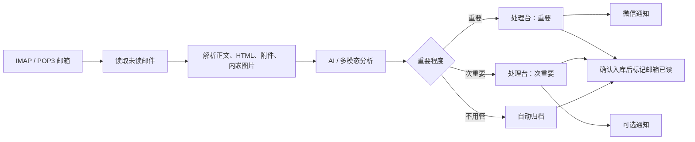

<p align="center">
  
</p>

<h1 align="center">自动邮件系统</h1>

<p align="center">
  自托管 AI 邮件分拣台：读取 IMAP/POP3 未读邮件，生成中文摘要，按重要程度排队，分析图片/PDF 附件，并可把重点推送到微信。
</p>

<p align="center">
  <a href="README.md">English</a>
</p>

<p align="center">
  
</p>

## 解决什么问题

邮件难处理不只是因为数量多，而是学校通知、账号安全、账单、回执、截止日期和营销广告都混在一起，看起来同样吵。

自动邮件系统先帮你读，再给你一个干净的处理队列：

| 邮箱痛点 | 系统怎么解决 |
| --- | --- |
| 未读邮件太多 | 从一个或多个 IMAP/POP3 邮箱读取未读邮件 |
| 不知道哪封重要 | 将邮件分成重要、次重要、不用管 |
| 长英文邮件读起来费劲 | 生成中文摘要、判断理由和建议动作 |
| 重要内容藏在图片或 PDF 里 | 使用多模态模型分析内嵌图片、图片附件和 PDF |
| 容易漏掉急事 | 可将指定分类的摘要推送到微信 |

## 快速开始

前置条件：

- Node.js 24.x
- npm
- 一个支持 IMAP 或 POP3 的邮箱账号
- 与当前模型配置兼容的 AI API Key

本地运行：

```bash
npm install
npm run build
npm run start
```

打开：

```text
http://127.0.0.1:8787
```

开发模式：

```bash
npm run dev
```

前端默认运行在 `http://127.0.0.1:5173`，后端 API 默认运行在 `http://127.0.0.1:8787`。

## Docker / GHCR

仓库会通过 GitHub Actions 发布 Docker 镜像到 GitHub Container Registry：

```bash
docker pull ghcr.io/ha22yx/auto-email-system:latest
docker run -d \
  --name auto-email-system \
  -p 8787:8787 \
  -v auto-email-data:/data \
  -e DATA_DIR=/data \
  ghcr.io/ha22yx/auto-email-system:latest
```

镜像由 `.github/workflows/docker-publish.yml` 在 `main` 分支推送后自动构建。不要把邮箱授权码、AI API Key、微信/ClawBot 会话、`.env` 或 `data/` 打进镜像；这些敏感信息应通过运行时配置、应用 UI 或挂载的 `/data` 数据卷提供。

## 首次配置

1. 登录管理面板。
2. 修改默认登录密码。默认密码是 `Admin12345`，公开部署前必须修改。
3. 在 AI API 中填入模型服务配置。
4. 在多邮箱配置中添加 IMAP/POP3 邮箱。
5. 点击测试连接，确认邮箱授权码、主机、端口无误。
6. 回到处理台点击“立即处理”，或开启自动轮询。

常用邮箱端口：

| 协议 | SSL/TLS | 非加密 |
| --- | ---: | ---: |
| IMAP | `993` | `143` |
| POP3 | `995` | `110` |

多数邮箱需要在邮箱后台开启 IMAP/POP3，并使用“授权码”而不是网页登录密码。

## 核心功能

| 能力 | 价值 |
| --- | --- |
| 多邮箱控制台 | 支持 IMAP 和 POP3，可分别查看每个邮箱，也可汇总全部邮箱。 |
| AI 分拣 | 将未读邮件分成重要、次重要、不用管。 |
| 中文摘要 | 为每封邮件生成中文摘要、判断理由和建议动作。 |
| 多模态附件分析 | GLM-5V-Turbo 可分析内嵌图片、图片附件和 PDF。 |
| 安全原件预览 | 邮件 HTML 在 sandbox iframe 中渲染，危险行为被阻止。 |
| 系统内已读/未读 | 重要邮件可保持系统未读，直到你真正停留查看。 |
| 微信通知 | 集成 WeClaw / ClawBot 桥接，可将指定分类摘要推送到微信。 |
| 自托管存储 | 单个 Node 应用运行，本地 JSON 存储在 `data/app.db.json`。 |

## 优先级队列

| 分类 | 适合放什么 | 默认处理方式 |
| --- | --- | --- |
| 重要 | 老师、学校事务、账号安全、付款异常、合同、截止日期、需要回复的邮件 | 留在处理台，系统内默认未读，可微信通知 |
| 次重要 | 付款回执、订单确认、账单记录、一般通知、之后可以看的资料 | 点击即系统内已读，可按需微信通知 |
| 不用管 | 推广、招生广告、新闻简报、订阅营销、社交提醒、低价值通知 | 自动归档为系统已读 |

## 工作流



## 技术栈

| 层 | 技术 |
| --- | --- |
| 前端 | React 19, Vite, TypeScript, Phosphor Icons |
| 后端 | Express 5, TypeScript, tsx |
| 邮件 | imapflow, mailparser, 自定义 POP3 读取 |
| AI | 智谱 GLM Coding Plan / Anthropic-compatible API, GLM-5V-Turbo 多模态 |
| 存储 | 本地 JSON 数据库：`data/app.db.json` |
| 通知 | 项目内 WeClaw / ClawBot 桥接 |

## AI 配置

默认面向智谱 GLM Coding Plan：

| 项 | 默认值 |
| --- | --- |
| Anthropic-compatible Base URL | `https://open.bigmodel.cn/api/anthropic` |
| Chat Completions Base URL | `https://open.bigmodel.cn/api/coding/paas/v4` |
| 文本模型 | `glm-5.2` |
| 多模态模型 | `glm-5v-turbo` |

系统提示词会强约束分类逻辑：

- 需要你处理、查看、确认、回复、保存的重要信息进入“重要/次重要”。
- 推广、招生广告、新闻、订阅营销进入“不用管”。
- 付款回执、扣款确认、订单确认、账单记录进入“次重要”，不直接归为不用管。
- 老师、学校工作人员、课程、作业、截止时间、账号安全等进入“重要”。

## 微信通知

管理面板内置 ClawBot 推送配置。开启后，系统可以在重要邮件入库后推送到微信。

特性：

- 项目启动时可自动启动通知桥接。
- 扫码绑定后会保存会话状态，重启后继续使用。
- 可分别控制重要、次重要、不用管是否通知。
- 只发送系统整理后的邮件信息，不会把你的微信聊天内容交给 AI。

WeClaw 来源：<https://github.com/fastclaw-ai/weclaw>  
相关许可文件保存在 `tools/weclaw/LICENSE`。

## 安全设计

这个项目会接触邮箱授权码、AI Key 和邮件原文，因此安全设计不是装饰项。

| 防护 | 说明 |
| --- | --- |
| 登录保护 | 管理面板需要密码登录，会话默认保存 7 天。 |
| 密码存储 | 管理密码使用 PBKDF2 + salt 哈希存储。 |
| 防爆破 | 登录失败过多会临时限制来源 IP。 |
| CSRF 防护 | 非可信来源的修改请求会被拦截。 |
| 安全响应头 | 启用 CSP、X-Frame-Options、nosniff、Referrer-Policy 等。 |
| 邮件原件沙箱 | 邮件 HTML 在 sandbox iframe 中显示，禁用脚本、表单和插件。 |
| 图片代理 | 远程图片经过后端代理，阻止内网地址、认证 URL、异常端口和超大文件。 |
| 搜索引擎屏蔽 | 内置 `robots.txt` 与 `X-Robots-Tag`，避免被搜索引擎索引。 |

重要提醒：`data/` 会保存邮箱授权码、AI Key、处理后的邮件数据和运行状态，已经在 `.gitignore` 中排除。不要把 `data/`、`.env`、服务器密码或宝塔 API Key 提交到仓库。

## 部署建议

推荐部署方式：

- 本地长期运行
- VPS + Node.js
- 宝塔面板 Node 项目
- systemd / PM2 / Docker 自行封装

生产环境建议：

- 使用 HTTPS 域名访问。
- 修改默认登录密码。
- 限制服务器 SSH 登录方式。
- 定期备份 `data/app.db.json`。
- 不要把应用直接暴露给不可信用户共同使用。

## 仓库结构

```text
data/app.db.json      本地数据库，保存设置、邮箱、邮件和运行记录
public/robots.txt     搜索引擎屏蔽规则
server/src/           Express API、邮件处理、AI、通知、安全逻辑
src/                  React 管理控制台
tools/weclaw/         WeClaw / ClawBot 运行文件
```

## 适合谁

- 邮件很多，但真正需要处理的很少。
- 经常收到学校、老师、账单、安全、订单、付款回执等混杂邮件。
- 希望 AI 先帮你读一遍，再只把重点推给你。
- 想自托管，不想把邮箱长期交给第三方邮件客户端。

## License

当前仓库未声明统一开源许可证。若要用于公开二次分发，请先补充项目 License，并遵守 `tools/weclaw/LICENSE` 中 WeClaw 相关许可要求。
